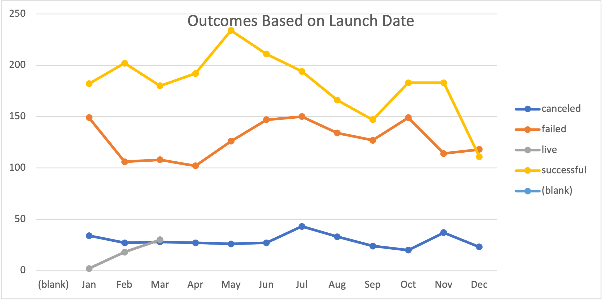

# Kickstarter Analysis
## Kickstarter campaign analysis
We started with a large dataset of Kickstarter campaign information that included monetary goals and amounts pledged for a variety of different campaigns. 
From the raw data we were able to determine which campaign were successful or not based on their categories, goals, and country. The outcomes based on parent category look like this:

The outcomes based on the subcategory are represented here:

We also wanted to provide insight on the relationship between when campaigns were launched with their success:

Overall, we were able to provide detalied analysis of the kicktarter data based on a variety of factors that can further interpreted in the workbook. 
